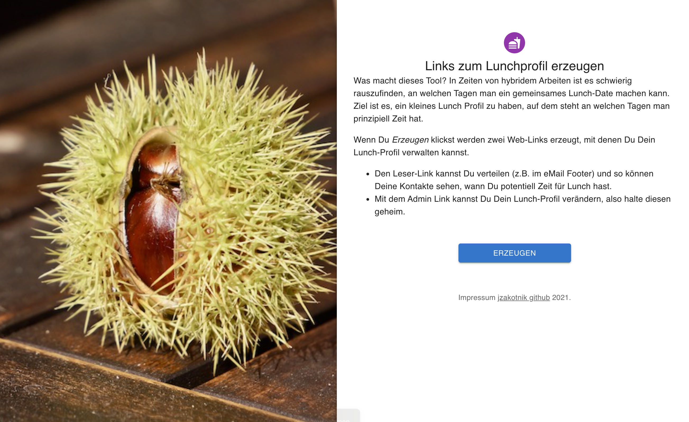
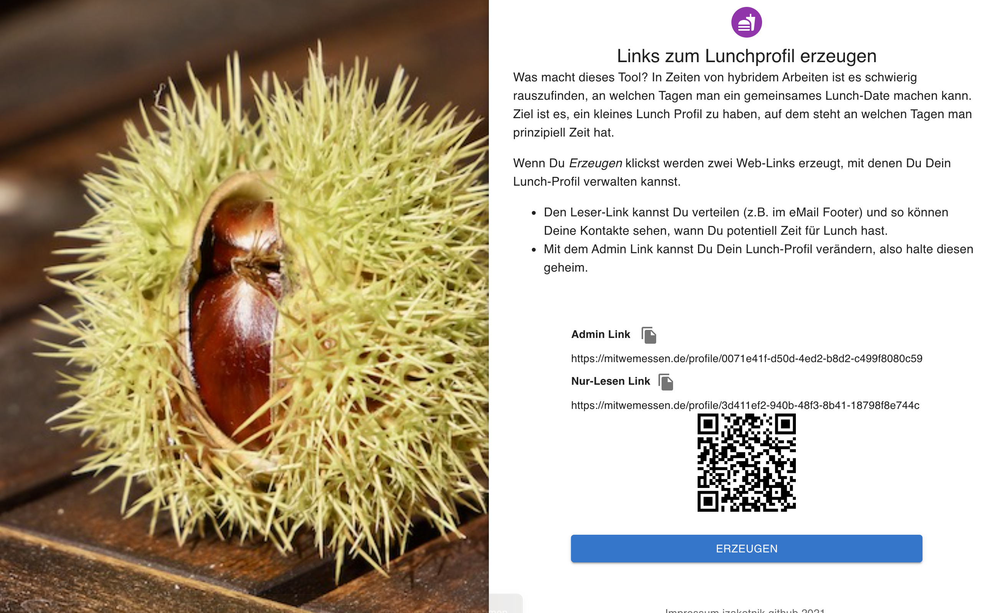
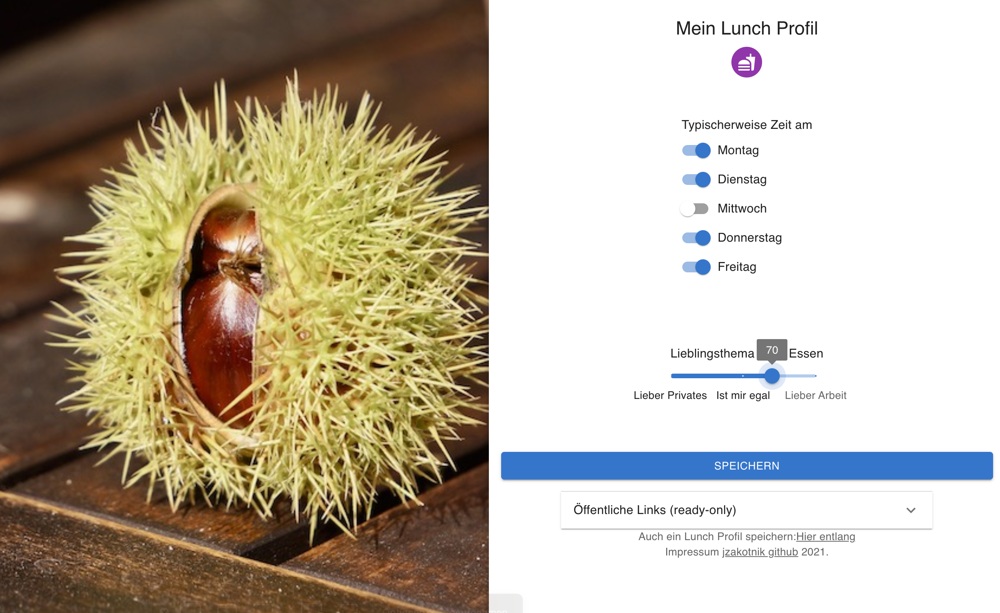
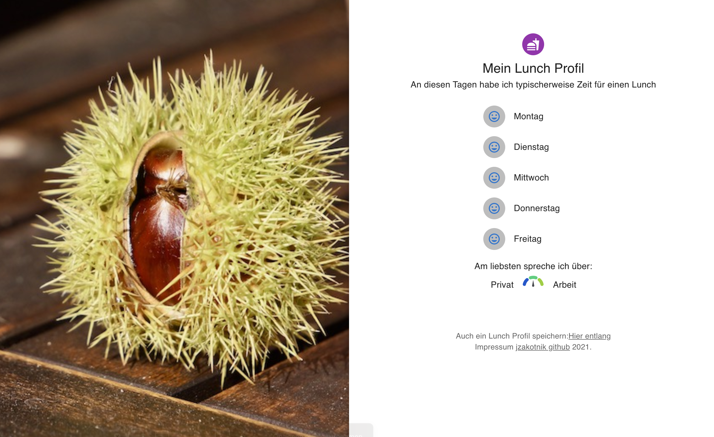

# Mitwemessen

## What is it about?

In hybrid work models, you need to know, on which days someone is in the office to go for lunch. This nice app helps you to maintain this information and distribute it to colleauges.

## Demo

Have a look at the [Demo Site](https://mitwemessen.de)

## Getting started

- Install node
- Clone repository
- npm install
- Copy env file
- npm run build
- In Prisma folder: yarn prisma migrate dev --name init
- Setup nginx and letsencrypt certs using certbot
- Route nginx config to node server
- Use pm2 to run node server on startup
